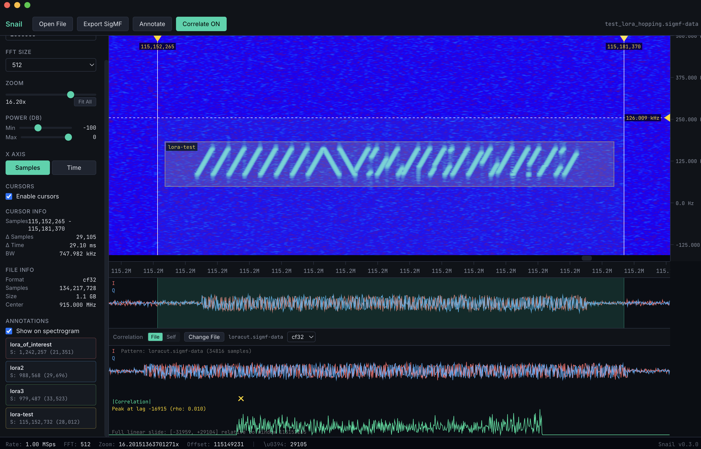

# SNAIL!

Forgive me lord, for I have 100% vibe coded a ~~fast~~ cross-platform IQ file analyzer built for signal processing workflows.


---

## Why the name? 

**S**pectral **N**avigation **A**nd **I**Q **L**ab - although i totally made the name "snail" first and then figured out what it means. Also something something about how snails leave trails and so do rf signals or something like that. 

Snail handles multi-gigabyte recordings with instant load times via memory-mapped I/O and GPU-accelerated spectrogram rendering. Built on the shoulders of giants like [inspectrum](https://github.com/miek/inspectrum), [liquid-dsp](https://github.com/jgaeddert/liquid-dsp), and [FFTW](https://www.fftw.org/).


## Snail in a Snail shell

<p align="center"></p>


- **Instant file loading** — Memory-mapped I/O opens gigabyte-scale files in milliseconds
- **SigMF support + annotation** — Reads `.sigmf-meta` + `.sigmf-data` pairs, auto-detects sample rate and center frequency, add annotations time and frequency (boxes)!
- **11 IQ formats** — cf32, cf64, cs32, cs16, cs8, cu8, rf32, rf64, rs16, rs8, ru8
- **Dual-axis cursors** — Measure time/sample deltas and frequency/bandwidth
- **I/Q trace plot** — Time-domain waveform view synced with the spectrogram
- **SigMF export** — Export cursor-selected regions with optional bandpass filtering
- **Cross-correlation** — FFT-based cross-correlation against a second file
- **Time/Samples toggle** — Switch X-axis between raw sample indices and SI-formatted time

## Installation

### Docker with noVNC 

This is a pretty shit way to experience snail! But you can run Snail in a Docker container and access it from any browser — no native dependencies needed. Uses noVNC to stream the desktop UI over WebSockets. 

<p align="center"></p>

#### 1. Mount your IQ data

Edit `docker-compose.yml` and point the volume to your local IQ files:
```yaml
volumes:
  - /path/to/your/iq/files:/data
```

#### 2. Build and start the container

```bash
docker compose up --build
```

#### 3. Open in your browser

Navigate to **[http://localhost:6080/vnc.html](http://localhost:6080/vnc.html)** and click **Connect**.

#### 4. Open a file

Inside the Snail window, click **Open File** and browse to `/data` — your mounted IQ files will be there.

> **Tip:** The default resolution is 1600x900. Change it in `docker-compose.yml` via the `VNC_RESOLUTION` environment variable.

### Pre-built Binaries

Binaries for macOS (Apple Silicon) and Linux are available on the [Releases](https://github.com/spetca/snail/releases) page.

**macOS note:** The app is not code-signed, so macOS will block it on first launch. After copying Snail to Applications, run:
```bash
xattr -cr /Applications/Snail.app
```
Or go to **System Settings > Privacy & Security** and click **Open Anyway**.

### Build from Source

#### Prerequisites

| Dependency | macOS | Ubuntu/Debian | Windows |
|---|---|---|---|
| Node.js 20+ | `brew install node` | `apt install nodejs npm` | [nodejs.org](https://nodejs.org) |
| CMake | `brew install cmake` | `apt install cmake` | [cmake.org](https://cmake.org) |
| FFTW3 | `brew install fftw` | `apt install libfftw3-dev` | vcpkg or prebuilt |
| liquid-dsp | `brew install liquid-dsp` | build from source | build from source |
| nlohmann-json | `brew install nlohmann-json` | `apt install nlohmann-json3-dev` | vcpkg |

#### Steps

```bash
# Clone the repository
git clone https://github.com/spetca/snail.git
cd snail

# Install Node dependencies
npm install

# Build the native C++ addon
npm run build:native

# Start in development mode
npm run dev
```

#### Package for Distribution

```bash
# Build everything and package
npm run build && npm run dist
```

Output binaries will be in `dist/`. The packager produces:
- **macOS** — `.dmg` (arm64)
- **Linux** — `.AppImage` and `.deb`

## Usage

### Opening Files

- **Drag and drop** an IQ file onto the window
- **Open File** button in the toolbar to browse

Snail auto-detects the format from the file extension. For SigMF files, open either the `.sigmf-meta` or `.sigmf-data` — Snail finds the partner file automatically.

### SigMF Export

1. Place cursors around the region of interest
2. Click **Export SigMF** in the toolbar
3. Optionally apply a bandpass filter using the frequency cursor range
4. Set filename, description, and author
5. Exports a `.sigmf-data` + `.sigmf-meta` pair

### Annotate SigMF

1. Enable **Cursors** and drag to select a time/frequency region
2. Click **Add Annotation** in the toolbar (or use `Ctrl+A`)
3. Enter a label and optional comment
4. The annotation is saved directly to the `.sigmf-meta` file and rendered as a persistent colored box on the spectrogram

### Correlation

1. Place cursors around a template region
2. Click **Correlate** in the toolbar
3. Select a second IQ file to correlate against
4. The correlation magnitude trace appears below the spectrogram

## Test Files

Generator scripts are included to create test IQ files for development and testing.

```bash
# Set up a Python virtual environment
cd test/fixtures
python3 -m venv venv
source venv/bin/activate   # Linux/macOS
# venv\Scripts\activate    # Windows
pip install -r requirements.txt

# Small chirp signals at 3 SNR levels (512 KB each)
python3 generate_chirps.py

# Large 1 GB LoRa-like frequency hopping file (stress test for mmap)
python3 generate_lora.py

deactivate
```

Generated IQ files and the `venv/` directory are gitignored — run the scripts after cloning to create them locally.

## Supported Formats

| Extension | Format | Description |
|---|---|---|
| `.cf32`, `.fc32`, `.cfile`, `.raw`, `.iq` | cf32 | Complex float32 (default) |
| `.cf64`, `.fc64` | cf64 | Complex float64 |
| `.cs32`, `.sc32` | cs32 | Complex signed int32 |
| `.cs16`, `.sc16` | cs16 | Complex signed int16 |
| `.cs8`, `.sc8` | cs8 | Complex signed int8 |
| `.cu8`, `.uc8` | cu8 | Complex unsigned int8 (RTL-SDR) |
| `.sigmf-data` + `.sigmf-meta` | SigMF | Auto-detected from metadata |
| `.rf32`, `.f32` | rf32 | Real float32 |
| `.rf64`, `.f64` | rf64 | Real float64 |
| `.rs16`, `.s16` | rs16 | Real signed int16 |
| `.rs8`, `.s8` | rs8 | Real signed int8 |
| `.ru8`, `.u8` | ru8 | Real unsigned int8 |

## Architecture

```
src/
├── main/              Electron main process
├── preload/           Context bridge API
├── renderer/          React UI + WebGL spectrogram
│   ├── components/    UI components
│   ├── webgl/         Tile renderer, cache, colormap, shaders
│   └── state/         Zustand store
├── native/            C++ addon (FFTW, liquid-dsp, mmap)
│   └── src/           Input source, FFT engine, filters, SigMF, correlation
└── shared/            IPC channels, format types, unit formatters
```

**Native DSP** — FFTW for FFT computation, liquid-dsp for FIR bandpass filters, POSIX mmap for zero-copy file access. All heavy computation runs in async worker threads.

