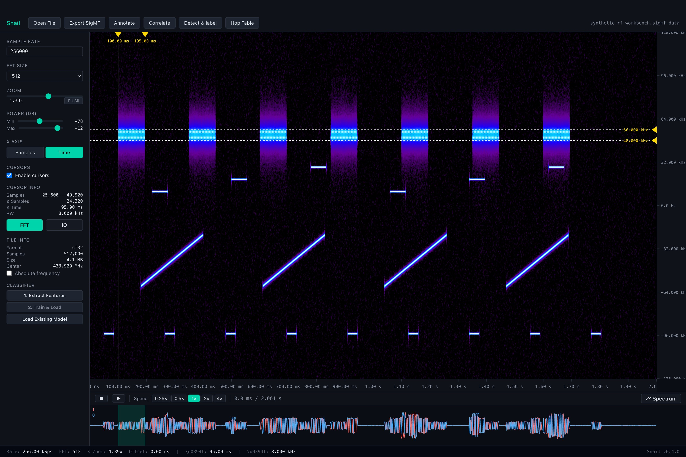
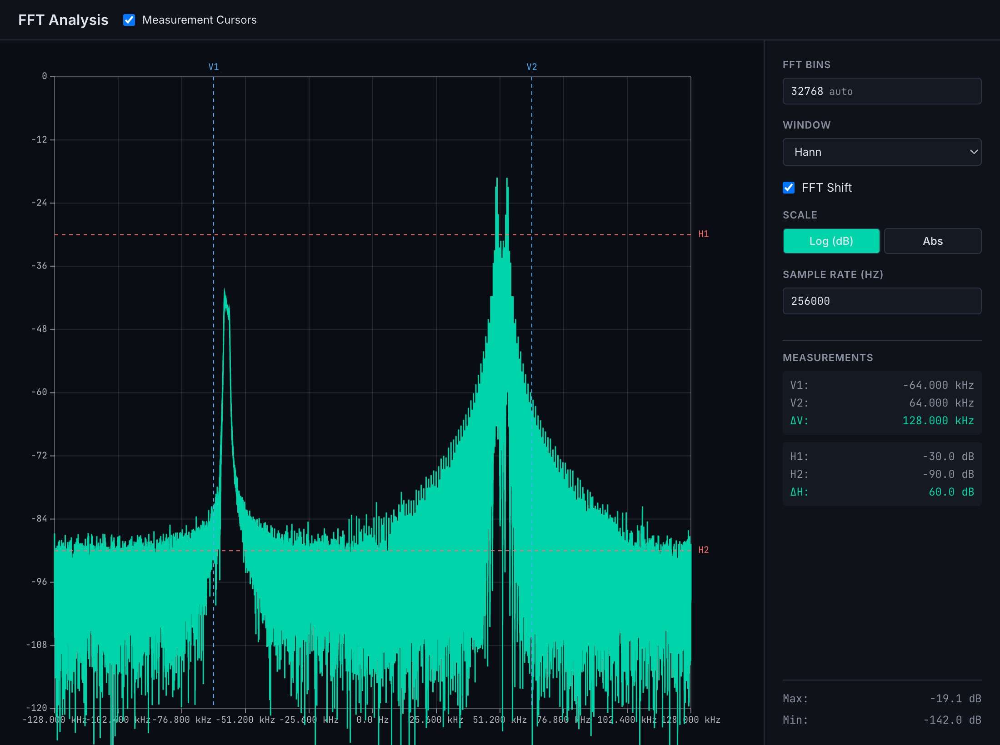
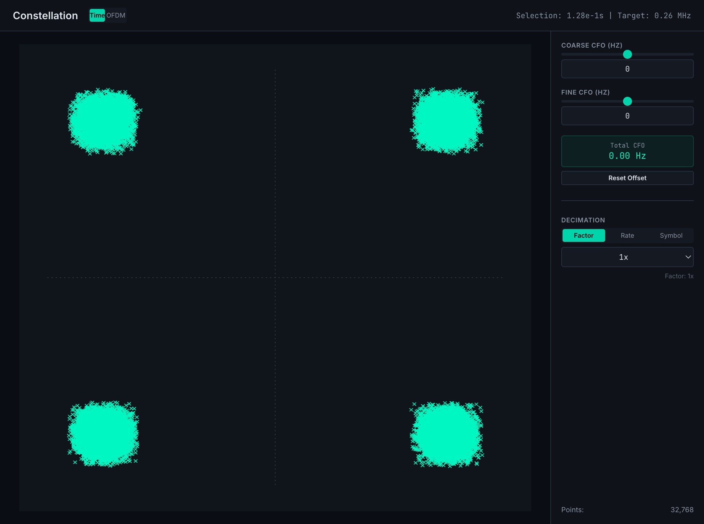
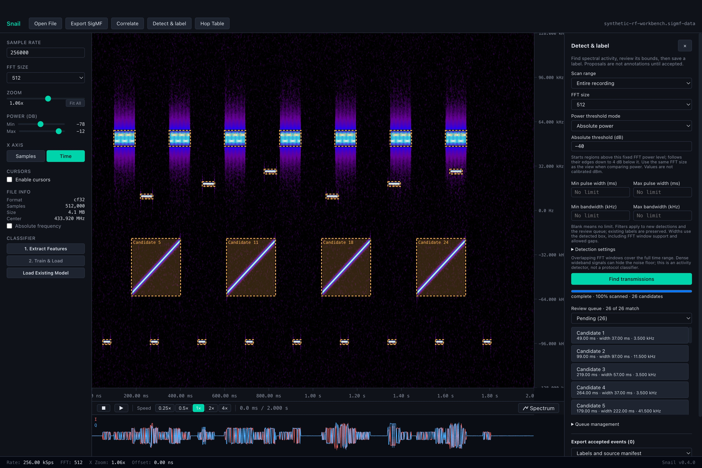
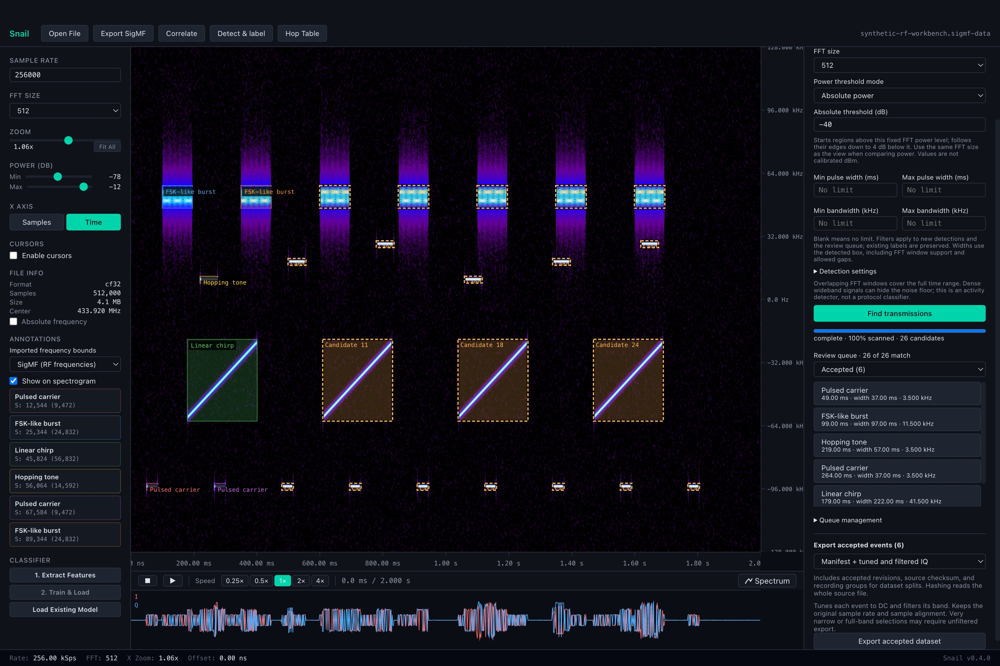

<div align="center">

# Snail

**Spectral Navigation And IQ Lab**

Explore IQ recordings, label signals for RFML, and create SigMF annotation markup—all in one RF workbench.

[Download for macOS & Linux](https://github.com/spetca/snail/releases) · [Quick start](#from-recording-to-labels) · [Build from source](docs/development.md) · [Roadmap](docs/rfml-roadmap.md)


[](LICENSE)

</div>



Snail is a desktop workbench for inspecting IQ recordings, reviewing signal events, and preparing RFML data. Memory-mapped input and a WebGL spectrogram let you navigate recordings without loading the entire file into memory.

## Download

Get the installers from [GitHub Releases](https://github.com/spetca/snail/releases).

| Platform | Architecture | Download |
| --- | --- | --- |
| macOS | Apple Silicon / ARM64 | `.dmg` — open it and copy Snail into Applications |
| Linux | x86-64 | `.AppImage` — make executable and run |
| Linux | x86-64, Debian/Ubuntu | `.deb` — install with your package manager |

For an AppImage:

```bash
chmod +x Snail-*.AppImage
./Snail-*.AppImage
```

macOS builds are currently unsigned. After copying Snail into **Applications**, run this once before opening it:

```bash
xattr -cr /Applications/Snail.app
```

Releases target macOS and Linux only.

## Inspect the signal

Zoom through time and frequency, place cursors around a transmission, and keep the same physical selection while navigating. Measure duration and bandwidth alongside the IQ trace, then inspect spectra, constellation views, or correlation results.

| Tool | What it helps you do |
| --- | --- |
| GPU spectrogram | Navigate time/frequency structure with adjustable FFT size and power range |
| Physical cursors | Measure samples, duration, frequency, and bandwidth without losing the selection on zoom |
| IQ and spectrum views | Compare waveform structure with frequency-domain measurements |
| Correlation | Investigate repeated patterns and compare recordings |
| Hop table | Inspect pulse timing and candidate hopping behavior |
| SigMF annotations | Save reviewed time/frequency regions alongside the recording |

## Look closer with FFT and constellation views

Select a region with the time cursors, then use **FFT** or **IQ** in the cursor panel to open a dedicated analysis window.

### FFT analysis

Inspect spectral peaks with selectable FFT size, window function, frequency shift, and power scale. Enable measurement cursors to compare frequencies and power levels.



### Constellation analysis

Plot the selected complex samples in the IQ plane. Adjust coarse/fine frequency offset and decimation, or switch to the OFDM view to inspect a selected FFT bin. The example below uses a generated QPSK fixture with noise; the four clusters come from the samples themselves.



## Find transmissions, then review them

**Detect & label** proposes activity regions for inspection. Scan the current time/frequency view, a cursor time range, or the entire recording. Use **pulse-width and bandwidth limits** to focus the queue, and choose either a noise-relative threshold or a fixed **Absolute power** threshold.



Select a candidate to focus its region. Adjust the bounds, give it a label, and accept or reject it. Proposals stay separate from accepted annotations; detector settings, edits, and review history persist across restarts. Accepted labels are saved into SigMF metadata, leaving the source IQ untouched.

### From recording to labels

1. **Open a recording.** Drag in IQ data or use **Open File**. Standard SigMF metadata/data pairs carry sample rate and tuning information.
2. **Inspect a representative region.** Adjust FFT size, zoom, and display power. Enable cursors to measure a burst.
3. **Find transmissions.** Open **Detect & label**, choose a scan range, and set pulse-width/bandwidth limits if needed.
4. **Review the queue.** Select a candidate, edit its bounds or use the cursors, enter a label, and choose **Accept label**.
5. **Export accepted events.** Save a labels/source manifest, IQ crops, or tuned and filtered IQ for your pipeline.

<details>
<summary><strong>Detection tips and queue management</strong></summary>

- Pulse width is in **milliseconds**, bandwidth in **kHz**. Blank bounds mean no limit; limits are inclusive. Measurements use the detected rectangle, including FFT support and allowed gaps.
- Noise-relative detection measures contrast against the estimated background. A bright, broad signal can raise that estimate and be missed. Try **Absolute power** for a fixed FFT power threshold; use the same FFT size as the view when comparing levels.
- Existing proposals remain between scans. To start fresh, finish or cancel the scan, then open **Queue management → Reset review queue**. This archives review history and clears proposals/run history while retaining accepted SigMF labels. Export accepted datasets first if you need the current queue's accepted events.
- The queue is limited to **2,000 proposals**. Narrow the scan or filters before rescanning a crowded recording.
- Open the full recording for detection and dataset export, then restrict the scan range. Partial-file load windows are not supported by this workflow yet.
- This detector finds activity; it does not automatically identify a protocol. Visual similarity search is planned, not currently implemented.

</details>

## Deliver data with its history

Export only the events you have accepted. Choose a lightweight manifest, unfiltered complex-float32 crops, or IQ mixed to the selected band's center and filtered. The first channelizer preserves the original sample rate and compensates filter delay so every output sample has a defined position in the source.



Each dataset includes:

- Source SHA-256 and checksums for materialized IQ artifacts.
- Accepted labels, review revisions, detector settings, and processing recipes.
- Original sample mapping, capture information, and recording-group identifiers.
- SigMF pairs for IQ exports and a Python reader for verified NumPy access.

Exports show progress, support cancellation, and publish a new dataset folder when complete. Dataset splits remain **unassigned** so you can group related recordings before making training windows.

Read the [dataset format and Python examples](docs/dataset-export.md) for details, filter limits, and source alignment.

## Recording formats

Snail supports standard **SigMF metadata/data pairs** and these raw sample formats:

| Samples | Formats |
| --- | --- |
| Complex floating point | `cf32`, `cf64` |
| Complex signed integer | `cs32`, `cs16`, `cs8` |
| Complex unsigned integer | `cu8` |
| Real floating point | `rf32`, `rf64` |
| Real signed integer | `rs16`, `rs8` |
| Real unsigned integer | `ru8` |

Common aliases such as `.fc32`, `.cfile`, `.sc16`, and `.iq` are recognized. Raw recordings need the correct sample rate and format; metadata should be checked before analysis or export.

## Development

See [development and release instructions](docs/development.md) for native dependencies, local builds, tests, packaging, and screenshot capture.

The [RFML and reverse engineering roadmap](docs/rfml-roadmap.md) tracks remaining work: similarity retrieval, faster review, resampling, dataset split checks, and a deeper protocol workbench. It separates shipped functionality from proposed features and evaluation goals.

*Screenshots are captured from the real application and native DSP using reproducible synthetic RF and QPSK recordings. Signal names describe the generated fixture, not automatic protocol recognition.*

Built with Electron, React, FFTW, and liquid-dsp, with inspiration from [inspectrum](https://github.com/miek/inspectrum). See [LICENSE](LICENSE) for the GPLv3 terms.
